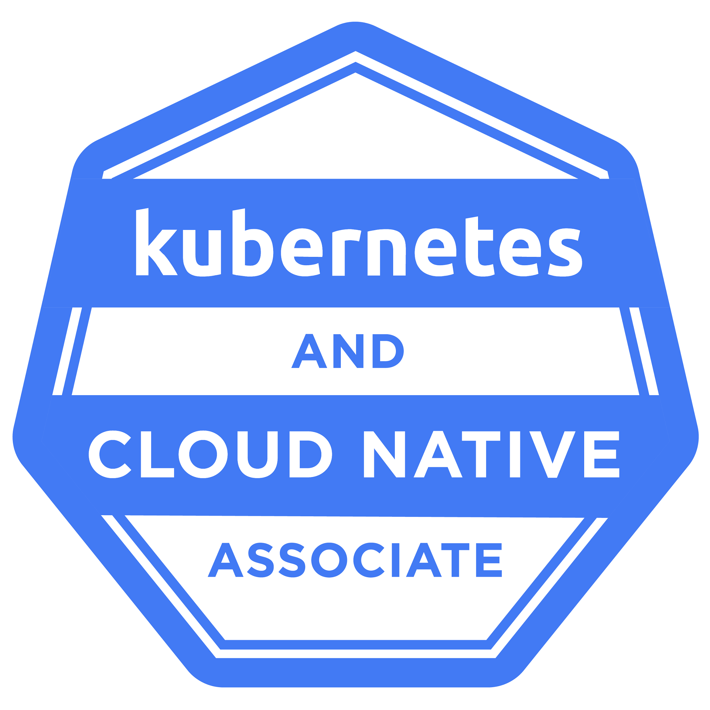

# Welcome to [Vaibhav Kumar Singh](https://www.linkedin.com/in/vaibhav-kumar-singh-1242a017/) profile! 

## Glad to see you here!

I’m a Senior Product Engineer with 10+ years in the geospatial industry, focused on ArcGIS Enterprise, ArcGIS Enterprise on Kubernetes, GIS automation, and cloud-native solutions.

I work on building and improving enterprise GIS platforms with a strong focus on upgrade reliability, Kubernetes-based deployments, Python-driven automation, system scalability, and customer-focused geospatial workflows. My experience spans ArcGIS Enterprise, ArcGIS Server, ArcGIS Python API, ArcGIS JavaScript API, enterprise geodatabases, Utility Network, and GIS solution architecture.

I’m especially interested in solving problems at the intersection of GIS, platform engineering, cloud infrastructure, automation, and enterprise product reliability.

### Talking about Personal Stuff:

- 👨‍🎓 I'm a **Senior Product Engineer** focused on **Enterprise GIS** and **cloud-native geospatial platforms**.
- 🔭 I currently work on ArcGIS Enterprise on Kubernetes, upgrade workflows, and platform reliability
- 🐍 I use Python automation to simplify GIS validation, administration, and release workflows
- 💬 Ask me about ArcGIS Enterprise, ArcGIS Server, Enterprise Geodatabases, Utility Network, and GIS automation
- 📍 My core interests are ArcGIS Enterprise, ArcGIS Server, Enterprise Geodatabases, Utility Network, and GIS platform engineering
- 🌱 I'm currently learning:
  - Kubernetes
- 🌱 I’m currently expanding my public GitHub work around Kubernetes + GIS + ArcGIS APIs
- 📬 How to reach me: [vaibhavjba@gmail.com](mailto:vaibhavjba@gmail.com)
- 📝 [Resume](https://drive.google.com/file/d/1UT31Lzgh6prKkBPnIMqTDc1GqyFT6e4j/view?usp=sharing).
- 💪 This is where I write, code and solve problems:

&nbsp;&nbsp;&nbsp;&nbsp;&nbsp;&nbsp;&nbsp;&nbsp;

&nbsp;

&nbsp;

&nbsp;

---
<h3 align="left">Languages and Tools:</h3>
<table>
    <tr>
        <td style="font-weight: bold; padding-right: 10px; vertical-align: center; border: none;">Backend:</td>
        <td></td>
    </tr>
    <tr>
        <td style="font-weight: bold; padding-right: 10px; vertical-align: center;">Frontend:</td>
        <td></td>
    </tr>
    <tr>
        <td style="font-weight: bold; padding-right: 10px; vertical-align: center; border: none;">Database:</td>
        <td></td>
    </tr>
    <tr>
        <td style="font-weight: bold; padding-right: 10px; vertical-align: center; border: none;">DevOps:</td>
        <td></td>
    </tr>
    <tr>
        <td style="font-weight: bold; padding-right: 10px; vertical-align: center; border: none;">Version Control:</td>
        <td></td>
    </tr>
    <tr>
        <td style="font-weight: bold; padding-right: 10px; vertical-align: center; border: none;">Ides:</td>
        <td></td>
    </tr>
    <tr>
        <td style="font-weight: bold; padding-right: 10px; vertical-align: center; border: none;">Other Tools:</td>
        <td></td>
    </tr>
    <tr>
        <td style="font-weight: bold; padding-right: 10px; vertical-align: center; border: none;">Operating Systems:</td>
        <td></td>
    </tr>
</table>

----

<h3 align="left">Certifications:</h3>

<table>
  <tr>
    <td valign="top" width="120">
      
    </td>
    <td valign="top" style="padding-left:16px;">
      <strong><a href="https://training.linuxfoundation.org/certification/kubernetes-and-cloud-native-associate-kcna/" target="_blank">KCNA — Kubernetes and Cloud Native Associate</a></strong> 
      Linux Foundation &nbsp;|&nbsp; 2025 
      <em>Kubernetes architecture, containers, cloud-native ecosystem, observability, and application delivery.</em>
        
      <strong><a href="https://www.esri.com/training/catalog/5f64012e5704e85f645c1831/arcgis-enterprise-administration-expert-professional/" target="_blank">EAEP — ArcGIS Enterprise Administration Expert Professional</a></strong> 
      Esri &nbsp;|&nbsp; 2025 
      <em>Advanced ArcGIS Enterprise architecture, deployment, configuration, and troubleshooting.</em>
        
      <strong><a href="https://www.esri.com/training/catalog/5f640131968b5a5f19d39c05/arcgis-enterprise-system-design-professional/" target="_blank">ESDP — ArcGIS Enterprise System Design Professional</a></strong> 
      Esri &nbsp;|&nbsp; 2025 
      <em>Enterprise GIS system design, capacity planning, high availability, and deployment patterns.</em>
    </td>
  </tr>
</table>

----

## 📕Latest Blog Posts

<!-- BLOG-POST-LIST:END -->
